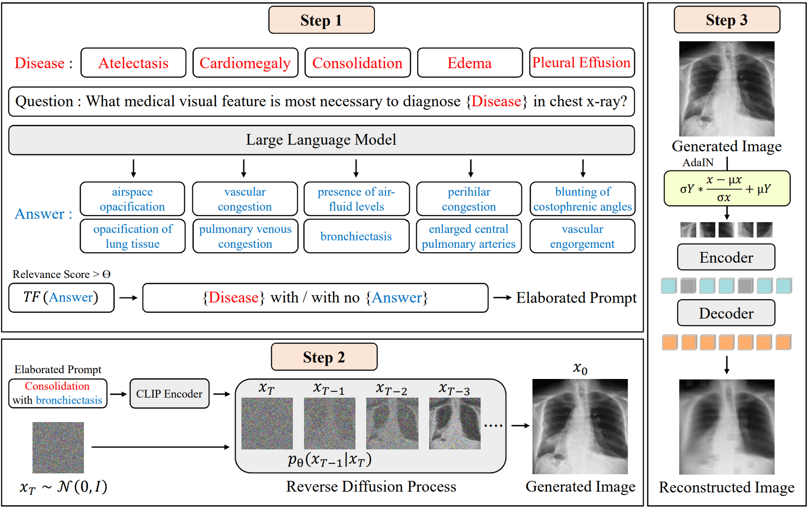

## Generative Self-Supervised Learning for Medical Image Classification

> <b>Generative Self-Supervised Learning for Medical Image Classification</b><br/>
>  Inhyuk Park, Sungeun Kim, Jongbin Ryu.<br/> 
> (Asian Conference on Computer Vision <b>(ACCV)</b>, 2024 ), <br/>




## How to cite
```
@article = {
    title = {Generative Self-Supervised Learning for Medical Image Classification},
    author = {Inhyuk Park, Sungeun Kim, Jongbin Ryu},
    Paper = {Asian Conference on Computer Vision (ACCV)},
    url = {},
    year = {2024},
}
```
## Acknowledgement
We referenced the implementation of [medical_mae](https://github.com/lambert-x/medical_mae)
